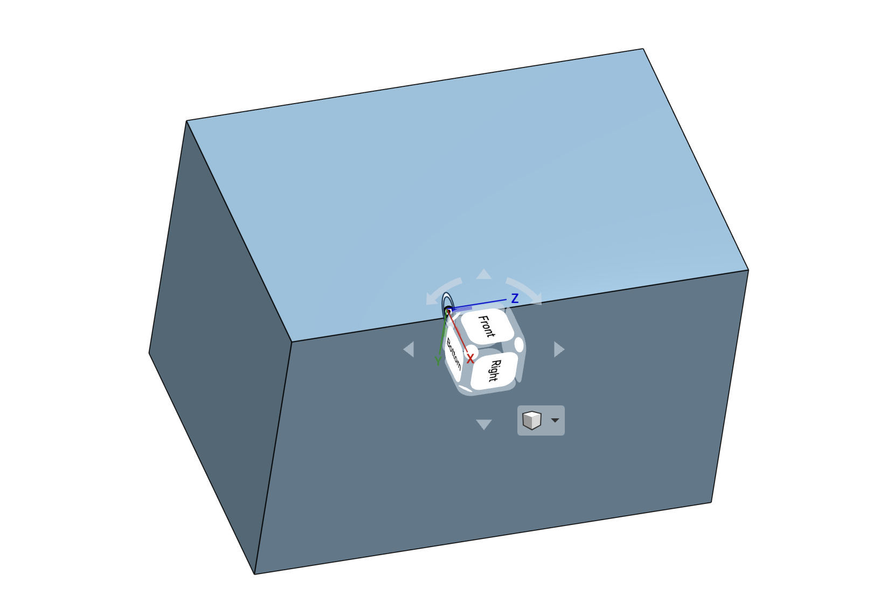
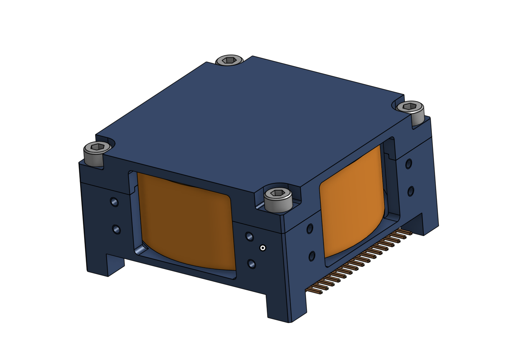
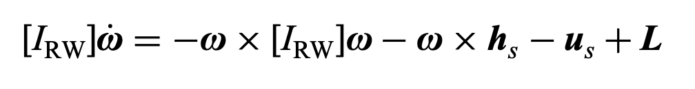

# 6 Degree of Freedom Spacecraft Simulation
This project simulates the behavior of a spacecraft in low earth orbit (LEO). This sim, with its basic rigid body dynamics and astrodynamics, may act as a testbed for more advanced GNC topics. I've tried to organize this project in a way that will make code modifications easy. 

## Software dependencies:
Runs on python, needs: numpy, scipy, matplotlib, and plotly. \
Go to this directory and type in the terminal:\
`python3 -m pip install -r requirements.txt`

## How I made this:
### Astrodynamics of Low Earth Orbit
Assuming a perfectly circular orbit at an altitude of 1500km.
Spacecraft position and velocity vectors are expressed in an Earth Centered Inertial Frame
### The Mission (desired body orientation)
The desired spacecraft attitude will be to point directly towards Earth
### Underlying Math (Quaternions, DCMs)
Quaternions are used to express the Directional Cosine Matrix (DCM) from the inertial to spacecraft body frame. Quaternions are a great choice to use because they do not have singularities. 

$$

\boldsymbol{{\beta}} =
\begin{bmatrix}
{\beta}_0 \\
{\beta}_1 \\
{\beta}_2 \\
{\beta}_3
\end{bmatrix}
$$

$$
\mathrm{DCM} =
\begin{bmatrix}
{\beta}_0^2 + {\beta}_1^2 - {\beta}_2^2 - {\beta}_3^2 & 2({\beta}_1 {\beta}_2 + {\beta}_0 {\beta}_3) & 2({\beta}_1 {\beta}_3 - {\beta}_0 {\beta}_2) \\
2({\beta}_1 {\beta}_2 - {\beta}_0 {\beta}_3) & {\beta}_0^2 - {\beta}_1^2 + {\beta}_2^2 - {\beta}_3^2 & 2({\beta}_2 {\beta}_3 + {\beta}_0 {\beta}_1) \\
2({\beta}_1 {\beta}_3 + {\beta}_0 {\beta}_2) & 2({\beta}_2 {\beta}_3 - {\beta}_0 {\beta}_1) & {\beta}_0^2 - {\beta}_1^2 - {\beta}_2^2 + {\beta}_3^2
\end{bmatrix}
$$
### Underlying Kinematics and Dynamics 
#### Kinematic Differential Equation for Quaternions:
$$
\boldsymbol{\dot{{\beta}}} = \frac{1}{2}[B(\boldsymbol{{\beta}})]^{b}\boldsymbol{\omega} 
$$

where 
$$
[B(\boldsymbol{{\beta}})] = 
\begin{bmatrix}
-{\beta}_1 & -{\beta}_2 & -{\beta}_3 \\
{\beta}_0 & -{\beta}_3 & {\beta}_2 \\
{\beta}_3 & {\beta}_0 & -{\beta}_1 \\
-{\beta}_2 & {\beta}_1 & {\beta}_0
\end{bmatrix}
$$

and $\boldsymbol{\omega}$ is the angular velocity of the body frame with respect to the inertial frame, written in body coordinates 
$$
^{b}\boldsymbol{\omega}  = 
\begin{bmatrix}
{\omega}_1 \\
{\omega}_2 \\
{\omega}_3 
\end{bmatrix}

$$

#### Euler's rotational equation of motion:
$$
^{b}\boldsymbol{\dot{\omega}} = (-[I]^{-1})^{b}\boldsymbol{\omega} \times ([I]^{b}\boldsymbol{\omega}) + [I]^{-1}\textbf{M} 
$$

where [I] is the moment of inertia matrix of the spacecraft body fixed frame centered at the center of mass.
Ideally, the body fixed frame will be the principal axis frame so that $[I]$ is a diagonal matrix. \
\
$\textbf{M}$ is a vector representing the applied moment. The applied moment can come from the environment or onboard controllers. 

### Spacecraft
For simplicity, let the spacecraft be a solid box with dimensions 20cm x 20cm x 30cm (a.k.a a 12U cubesat). Assuming that each 10cm cube in a cubesat is 1kg, $\mathrm{mass} = 12kg$

The above image describes the body fixed frame, centered at the center of mass, which is the geometric center for simplicity's sake. 

The X,Y, and Z axes are chosen to be normal to each face of the cubesat, as that is the principal axis frame for a cuboid. 

$[I]$ for a cuboid is given as 
$$
[I] = 
\mathrm{mass} \begin{bmatrix}
\frac{1}{12}(b^2 + c^2) & 0 & 0 \\
0 & \frac{1}{12}(a^2 + c^2) & 0 \\
0 & 0 & \frac{1}{12}(a^2 + b^2)
\end{bmatrix}
$$

For our cubesat, 
$$
[I]_{cubesat} = 
 \begin{bmatrix}
.13 & 0 & 0 \\
0 & .13 & 0 \\
0 & 0 & .08
\end{bmatrix} \mathrm{kg*m^{2}}
$$

Assuming that a 3U cubesat has a magnetic dipole moment of $9 \times 10^{-3} A \cdot m^2 $ according to tests at NASA Goddard, we may assume that our 12U cubesat has a magnetic dipole moment of $ 3.6 \times 10^{-2} A \cdot m^2 $ 
Let's assume the magnetic dipole moment acts in the body x-direction

$$
\mathbf{m^b} = \begin{bmatrix}
3.6 \times 10^{-2} \\
0 \\
0

\end{bmatrix} \mathrm{A \cdot m^2}
$$

### Attitude Determination
### Sensors
### Actuators
The spacecraft will use three reaction wheels that are aligned with the principal body axes in order to control its attitude. 

The chosen reaction wheels are the RW400's by AAC Clyde Space:

The equation which relates the reaction wheel torques to spacecraft motion is outlined in Equation 4.140 *Analytical Mechanics of Space Systems* by Schaub and Junkins.

where 
$$
\mathbf{h_s} = \begin{pmatrix} 
J_{s_1} ({\omega}_{s_1} + {\Omega}_1) \\
J_{s_2} ({\omega}_{s_2} + {\Omega}_2) \\
J_{s_3} ({\omega}_{s_3} + {\Omega}_3) 
\end{pmatrix}
$$

$$
\mathbf{u_s} = \begin{pmatrix} 
\text{torque at RW no. 1} \\
\text{torque at RW no. 2} \\
\text{torque at RW no. 3} 
\end{pmatrix}
$$

$[I_{RW}]$ = moment of inertia of entire spacecraft plus the inertia components of the reaction wheels (except about the spin axis)

$\mathbf{{\omega}}$ = the angular velocity of the spacecraft relative to the inertial frame

$\mathbf{\dot{\omega}}$ = the angular acceleration of the spacecraft relative to the inertial frame

${\omega}_{s1}$ = the component of ${\omega}$ in the direction of reaction wheel #1's spin axis

$J_{s1}$ = moment of inertia of reaction wheel #1 about its spin axis

${\Omega}_1$ = the spin rate of the reaction wheel #1 about its housing

$L$ = external moments acting on the spacecraft

### Disturbances:

The two environmental disturbances that were modeled in this simulation include the gravity gradient torque and the torque due to Earth's magnetic field.

The equation for the gravity gradient torque comes from S&J 4.152.
$$
L_G = \frac{3GM_e}{R_c^5}\mathbf{R_c} \times [I]\mathbf{R_C}
$$

The equation for the magnetic field torque comes from simplifying Earth's magnetic field is a dipole magnet.

$$
\mathbf{B^n} = B_0(\frac{R_{eq}}{||r||})^3 \begin{bmatrix}
cos(\lambda)\\
0\\
2sin(\lambda)\\
\end{bmatrix}
$$
Where $\lambda$ is the lattitude, $B_0$ is the magnetic field magnitude at the equator, and $R_{eq}$ is the equatorial radius of the Earth.

The above equation gives the magnetic field in North-East-Down (NED) Coordinates. We need to convert to body coordinates using DCM's in order to work with the torque equation:

$$
\mathbf{M_{torque}^{b}} = \mathbf{m^b} \times \mathbf{B^b}
$$

where $\mathbf{m^b}$ is the magnetic dipole moment of the spacecraft in body coordinates and $\mathbf{B^b}$ is the magnetic field of the Earth in body coordinates. 

### Future additions

### References:
Schaub and Junkins Analytical Mechanics of Space Systems

